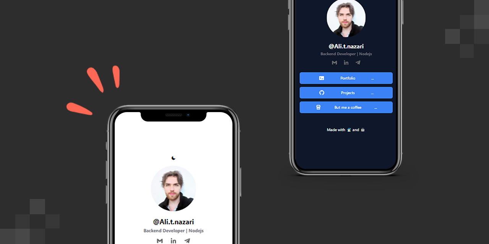

# Personal linktree

## License 🔐

[MIT](https://choosealicense.com/licenses/mit/)

This project is licensed under the MIT License. You are free to modify, distribute, and use the code for personal and commercial purposes. See the LICENSE file for details.

## Sponsor ❤

If you like this project, please give it a star ⭐ and/or consider buying me a coffee(s). Every donation is appreciated.

